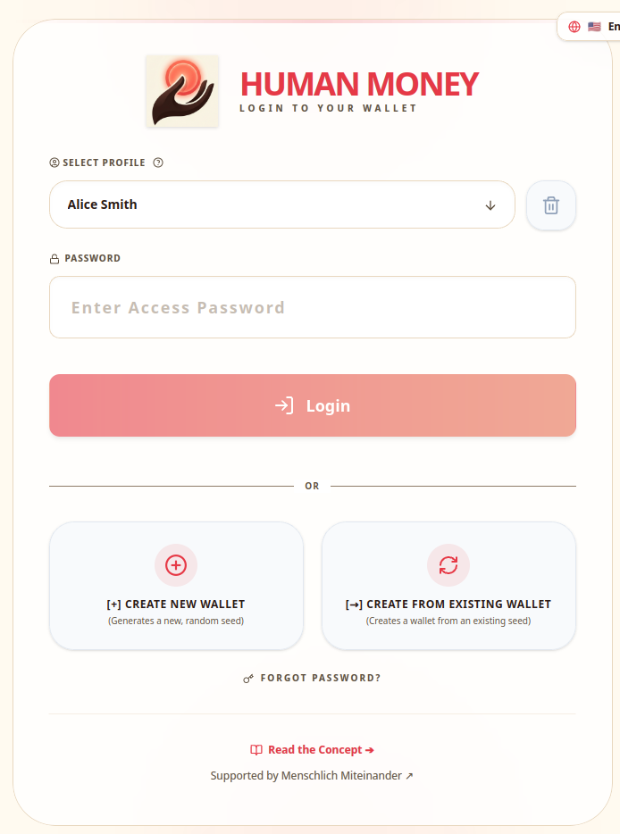
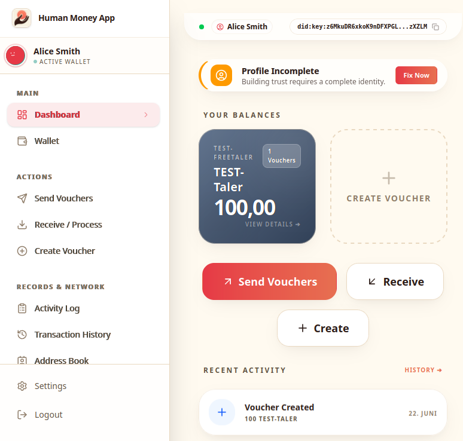
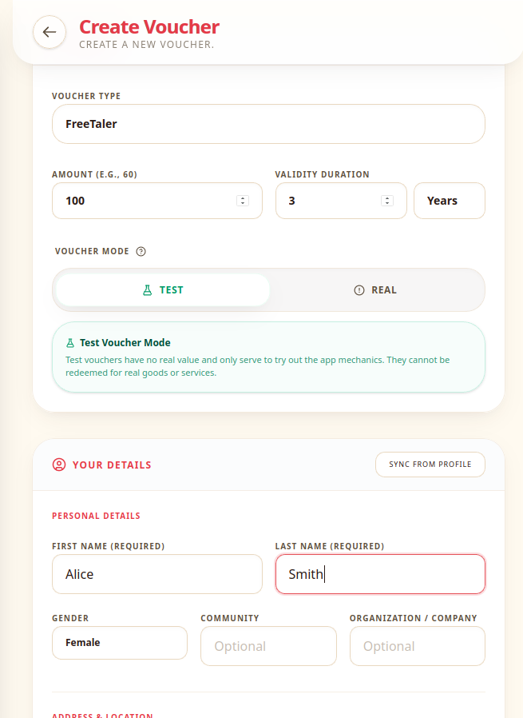
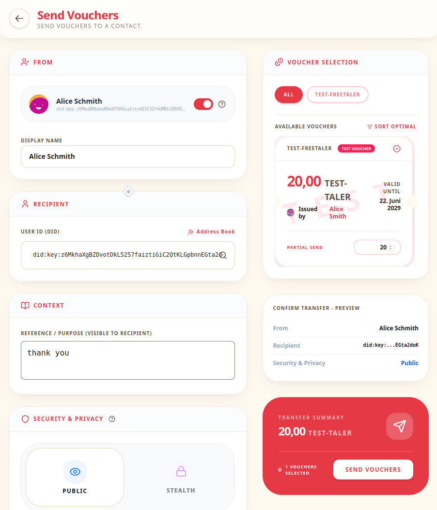
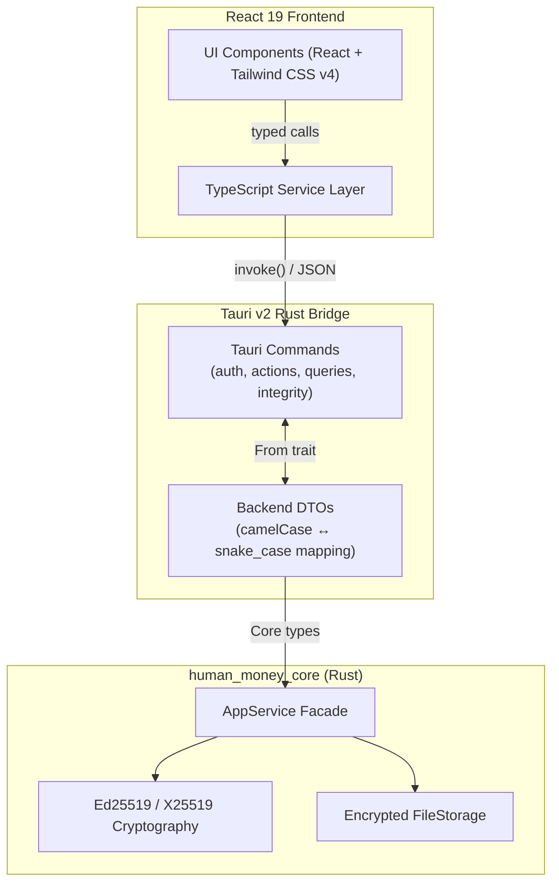

<div align="center">


# Human Money App

**Money from people, for people — no banks, no blockchain.**

The first open-source desktop wallet for human-issued, offline-first, trust-based value exchange.

[](https://github.com/minutogit/human-money-app/actions)
[](LICENSE)
[](https://github.com/minutogit/human-money-app/releases)
[](https://github.com/minutogit/human-money-app/releases)
[](#-localization)
[](#%EF%B8%8F-status--disclaimer)

> **⚠️ This is an early MVP / Prototype.** Intended for experimentation and community testing. Not recommended for high-value production use yet.

</div>

---

## 🌱 A New Paradigm for Value Exchange

Human Money introduces a fundamentally different model for how value can be created and exchanged. It is not a cryptocurrency, not a banking app, and not a payment processor. It is a **complementary, decentralized value exchange system** — built around the principle that every person, business, community, or even a municipality can create their own value instruments, backed by whatever they choose.

| Traditional Money / Crypto | Human Money |
|---|---|
| Trustless — math replaces human trust | **Trust-based** — DID keys build real reputation over time |
| Prevent fraud through global consensus | **Detect fraud** deterministically — cheaters sign their own proof |
| Global ledger / blockchain required | **Knowledge lives in files** — no ledger, fully offline |
| Central bank or protocol issues money | **Anyone can issue** — person, firm, community, or state |
| Money tends to accumulate centrally | **Hyperlocal by design** — value always flows back to its emitter |

### What "Human Money" means

The name reflects the core idea: value originates from humans — from their time, skills, products, and promises — not from algorithms or institutions. The system is designed to put **people back at the center of economic exchange**.

---

## 📸 Screenshots

<p float="left">
  
  
</p>
<p float="left">
  
  
</p>

---

## 💡 How It Works

### The Voucher Lifecycle

Value is represented as **vouchers** — portable, cryptographically chained JSON files that carry their complete transaction history within themselves. Think of them as self-contained mini-blockchains.

```
1. Alice creates a voucher backed by her skills (e.g. 10 hours of carpentry work)
       ↓
2. She helps Bob and signs the voucher over to him (file + signature)
       ↓
3. Bob uses it to pay Carol, who passes it to Dave...
       ↓
4. Eventually the voucher returns to Alice — she honors it by delivering the promised work
       ↓
5. Alice can now issue new vouchers, maintaining a healthy circulation
```

Files can be exchanged via **any medium** — email, USB stick, messaging app, or local network. **No internet connection is required** for the transaction itself.

### The Fraud Detection Mechanism

Human Money does not try to prevent fraud — it makes fraud **mathematically certain to be discovered**:

> When someone attempts a double-spend, they must **digitally sign** the transaction twice. This creates tamper-proof cryptographic evidence directly in the signature chain. As files circulate and eventually converge, fraud is always detected.

Additionally, background **gossip mechanisms** distribute anonymous fingerprints across the network. Fraudsters do not even need to encounter the same person — their traces are distributed automatically.

**The consequence:** A fraudster must either face responsibility or lose their cryptographic reputation (DID key), effectively being excluded from the community. In a trust-based system, social exclusion is the ultimate penalty — and it is self-imposed.

### The Hyperlocal Property

Every voucher is intrinsically tied to its emitter. Even if it circulates globally, **value always returns to the local issuer**. This structural property:
- Prevents capital accumulation at scale
- Preserves the local character of value instruments, even in large networks
- Creates strong economic incentives for issuers to be trustworthy

---

## 🎫 Voucher Standards

A **standard** defines the rules for a type of voucher: what backs it, how long it is valid, what signatures are required, and how value is denominated. Standards are flexible — they can require guarantors, community endorsements, or no additional verification at all.

| Standard | Description | Status |
|---|---|---|
| **FreeTaler** | Test standard — intentionally worthless, for safe experimentation | Included |
| **Minuto** | Time-backed standard, inspired by the paper-based [Minuto](https://minutocash.org/) system. Backed by the issuer's skills and time, optionally secured by guarantors | Demo included |
| **Custom** | Any community, business, or region can define their own standard — backed by time, raw materials, services, fiat-pegged, or anything else the market agrees on | Open standard |

> **Vouchers are time-limited by design.** In practice they remain value-stable as long as they circulate and are redeemed. When redeemed, the issuer can create new vouchers, maintaining a healthy flow.

---

## ✨ App Features

### 🔒 Identity & Security
- **Multi-profile support** with encrypted local storage
- **BIP-39 Mnemonic recovery** (multi-language, including a custom high-security German wordlist)
- **Configurable session timeouts** and pessimistic directory locking
- **WalletSeal (Rollback Protection):** Detects and locks down stale or rolled-back wallet states
- **Device Binding (Anti-Cloning):** Prevents accidental state forks by binding profiles to a unique Host/Instance ID

### 🎫 Voucher Lifecycle
- Create vouchers based on flexible, TOML-defined standards
- Real-time signature impact evaluation against CEL standard rules
- Multi-signature workflows (request, create, attach, remove)
- Segmented test/real voucher mode selector
- GPS & map-link coordinate helpers for geolocation-aware vouchers

### 💸 Transactions
- Send value bundles with **3 encryption modes:**
  - **DID-Asymmetric** — encrypted for a specific recipient's public key
  - **Password-Symmetric** — encrypted with a shared password
  - **Cleartext** — maximum interoperability
- **Stealth Mode:** Hides the sender's DID from the transaction chain (except from the issuer). Fraud still mathematically exposes the identity.
- Auto-processing of incoming file bundles with smart password prompting

### 📊 History & Audit
- Full transaction history with detailed audit logs
- Balance aggregation by currency/standard
- Encrypted address book with contact trust management
- Activity log with stealth identity resolution (automatic DID → name lookup)

### ⚖️ Decentralized Fraud Management
- VIP Gossip propagation for anonymous fraud fingerprints
- Visual "Known Offender" reputation warnings
- Persistent local conflict overrides (forgiveness notes)
- Automated victim/witness role detection with test coverage

### 🌐 Localization
- Full UI localization in **English, German, Spanish, French, and Italian**
- Dynamic language detection and manual language selector
- Structured i18n error messages with variable interpolation

---

## 🏗️ Architecture & SDK



### The `human_money_core` SDK

The [`human_money_core`](https://github.com/minutogit/human-money-core) Rust library is the engine behind this app — and it is designed to be used by anyone building on the Human Money ecosystem.

It handles everything a client application needs:
- ✅ Cryptography (Ed25519 signatures, X25519/ChaCha20-Poly1305 encryption)
- ✅ Voucher standard parsing and validation
- ✅ Transaction chain management
- ✅ Fraud detection (NIZK identity traps, double-spend proofs)
- ✅ Encrypted file storage (storage-agnostic via trait)
- ✅ Multi-account support (SAI — Separated Account Identity)

> **Developers:** You can build your own client (mobile, web, embedded) on top of `human_money_core`. This desktop app is the reference implementation.

```toml
# Cargo.toml
[dependencies]
human_money_core = { git = "https://github.com/minutogit/human-money-core" }
```

---

## 🔐 Security & Privacy Model

### Fraud Detection via NIZK Identity Traps
Any double-spend attempt creates a **Zero-Knowledge Non-Interactive Proof** (NIZK trap) directly inside the signature chain. The cryptographic identity of the fraudster is mathematically exposed when evidence converges — even across separate transaction paths, via anonymous fingerprint gossip.

### WalletSeal — Rollback Protection
The wallet is continuously sealed with a cryptographic hash of its state. Any attempt to roll back to a previous state (e.g., to "un-spend" a voucher) triggers an immediate lockdown, requiring explicit recovery.

### Device Binding — Anti-Cloning
Each wallet instance is bound to a unique Host/Instance ID. Copying a wallet file to another device is detected and handled through a secure **device handover** workflow. Accidental state forks are prevented by design.

### Privacy & Stealth Mode
Transactions can include **Stealth Mode**, which uses ephemeral keys to hide the sender's DID from the transaction history (visible only to the original issuer). This is a deliberate privacy trade-off: increased anonymity makes fraud tracing more complex, requiring manual chain reconstruction. A fraud attempt in Stealth Mode still mathematically exposes the fraudster's DID key.

### Optional Layer 2 — Global Revocation Registry
The core library is prepared for an optional, asynchronous online layer that acts as a **decentralized registry for cryptographic locks** — enabling preventive double-spend checks without any global consensus mechanism. This layer is fully optional; the system functions completely offline without it.

---

## 🚀 Getting Started

### Prerequisites

- [Rust & Cargo](https://www.rust-lang.org/tools/install) (latest stable)
- [Node.js (v20+) & npm](https://nodejs.org/)
- [Tauri v2 system dependencies](https://v2.tauri.app/start/prerequisites/) for your platform

### Installation & Development

```sh
# 1. Clone the repository
git clone https://github.com/minutogit/human-money-app.git
cd human-money-app

# 2. Install frontend dependencies
npm install

# 3. Start in development mode (Vite dev server + Tauri window)
npm run tauri dev
```

### Download Pre-built Releases

Pre-built installers for Windows, macOS, and Linux are available on the [**Releases page**](https://github.com/minutogit/human-money-app/releases).

---

## 🧪 Testing

The project uses a multi-layer testing strategy:

```sh
# Run the full quality gate (recommended before any commit)
./run-tests.sh --quiet

# Frontend only (Vitest unit tests + ESLint + TypeScript checks)
./run-tests.sh --frontend-only

# Backend only (Cargo Clippy + Rust integration tests)
./run-tests.sh --backend-only
```

The test suite covers:
- **Frontend component tests** — React Testing Library (Vitest)
- **IPC contract tests** — Static analysis validating all `invoke()` calls against registered Rust commands
- **Rust integration tests** — Full command handler tests via `tauri::test::mock_builder`
- **Cargo Clippy** — Hardened linting with warnings-as-errors

---

## 🌍 Localization

The app is fully localized in **5 languages**: English, German, Spanish, French, and Italian.

```sh
# Check translation status (shows missing/outdated keys)
npm run i18n:status

# Prepare new keys for translation
npm run i18n:prep

# Merge translated results
npm run i18n:merge
```

---

## 🤝 Community & Support

The **Menschlich Miteinander** association supports this project. Their mission: *"Redesigning the tools of exchange — for more self-determination, genuine community, and living diversity."*

🌐 **Website:** [menschlich-miteinander.org](https://menschlich-miteinander.org/en/)

**Get involved:**
- ❓ Read the [**FAQ**](docs/faq/FAQ.md) — answers to 40+ common questions
- ⭐ Star this repo to show support
- 🐛 [Report a bug](https://github.com/minutogit/human-money-app/issues)
- 💬 Join the conversation at [menschlich-miteinander.org](https://menschlich-miteinander.org/en/)
- 🏗️ Build your own client using [human-money-core](https://github.com/minutogit/human-money-core)

---

## ⚠️ Status & Disclaimer

This is an **early-stage MVP / Prototype** — the first software to make the Human Money concept tangible. Core workflows (create, send, receive, fraud detection) are functional and tested.

- ✅ Suitable for: experimentation, community pilots, developer exploration
- ⚠️ Not yet suitable for: high-value production transactions
- 🚫 This is **not** a cryptocurrency, investment instrument, or financial product

The Minuto paper-based voucher system has been tested by various community groups. This app brings that concept into the digital world for the first time.

---

## 📄 License

This project is licensed under the **MIT License**. See the [`LICENSE`](LICENSE) file for details.

---

<div align="center">

*"Money is not an unchangeable fact — it is a social agreement that can open new spaces for cooperation and collective prosperity."*
— [Menschlich Miteinander](https://menschlich-miteinander.org/en/)

</div>